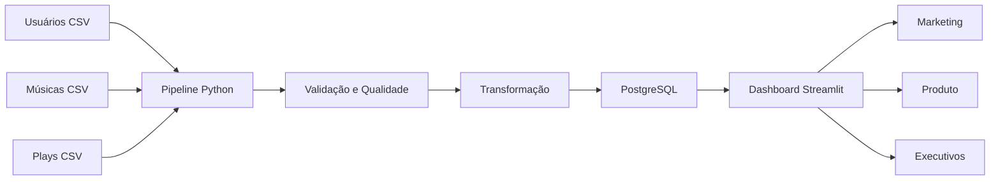

# sound-analytics-
#  Sound-Analytics

## Protótipo de Engenharia de Dados para Plataforma de Streaming Musical

### Integrantes

* Matheus Nery – RA 22309707

---

## Visão Geral

O Sound-Analytics é um protótipo de Engenharia de Dados desenvolvido para simular a infraestrutura de uma plataforma de streaming musical.

O projeto implementa um pipeline completo de dados, contemplando:

* Ingestão de dados
* Armazenamento
* Transformação
* Qualidade de dados
* Orquestração
* Consumo dos dados
* Monitoramento

O objetivo é disponibilizar informações estratégicas para equipes de Marketing, Produto, Executivos e Engenharia através de dashboards analíticos.

---

# Arquitetura



---

# Tecnologias Utilizadas

| Tecnologia | Finalidade        |
| ---------- | ----------------- |
| Python     | Pipeline de Dados |
| Pandas     | Transformação     |
| PostgreSQL | Armazenamento     |
| Docker     | Containerização   |
| Streamlit  | Dashboard         |
| SQLAlchemy | Integração Banco  |

---

# Estrutura do Projeto

```text
sound-analytics/

├── Dockerfile
├── docker-compose.yml
├── README.md

└── app

    ├── main.py
    ├── dashboard.py
    ├── requirements.txt

    └── data

        ├── usuarios.csv
        ├── musicas.csv
        └── plays.csv
```

---

# Pipeline de Dados

## 1. Ingestão

Os dados são extraídos de arquivos CSV simulando fontes operacionais da plataforma:

* Usuários
* Músicas
* Eventos de reprodução

---

## 2. Qualidade de Dados

São executadas verificações de:

* Chaves únicas
* Campos nulos
* Consistência dos registros

---

## 3. Transformação

Os dados são enriquecidos através de junções entre:

* Usuários
* Músicas
* Eventos de reprodução

Gerando uma visão analítica consolidada.

---

## 4. Armazenamento

Os dados tratados são carregados em um banco PostgreSQL executado em contêiner Docker.

---

## 5. Consumo

Os dados são disponibilizados através de um dashboard Streamlit contendo:

* Total de reproduções
* Artistas mais tocados
* Gêneros mais populares
* Visualização tabular dos dados

---

# Segurança

Foram aplicadas medidas básicas de segurança:

* Banco protegido por usuário e senha
* Separação entre aplicação e banco de dados
* Isolamento através de containers Docker

---

# Monitoramento

O pipeline registra eventos em arquivo de log:

* Inicialização
* Processamento
* Conclusão
* Erros

---

# Arquitetura As-Built

Durante a implementação houve adaptação da arquitetura inicialmente planejada.

A proposta original previa utilização de:

* Apache Kafka
* Apache Spark
* Apache Airflow
* Airbyte

Para garantir execução completa do protótipo dentro das limitações acadêmicas e de hardware, foi adotada uma solução simplificada utilizando:

* Python
* Pandas
* PostgreSQL
* Docker
* Streamlit

A arquitetura final mantém os princípios fundamentais da Engenharia de Dados, permitindo demonstrar todo o ciclo de vida dos dados de forma funcional.

---

# Como Executar

## Construir os containers

```bash
docker-compose up --build
```

## Acessar Dashboard

```text
http://localhost:8501
```

---


O dashboard permite visualizar:

* Quantidade total de reproduções
* Artistas mais ouvidos
* Gêneros musicais mais populares
* Dados processados para análise

---

# Conclusão

O Sound-Analytics demonstra a implementação de um pipeline completo de Engenharia de Dados, desde a ingestão até a disponibilização das informações para consumo analítico, seguindo boas práticas de arquitetura, qualidade, monitoramento e governança.
